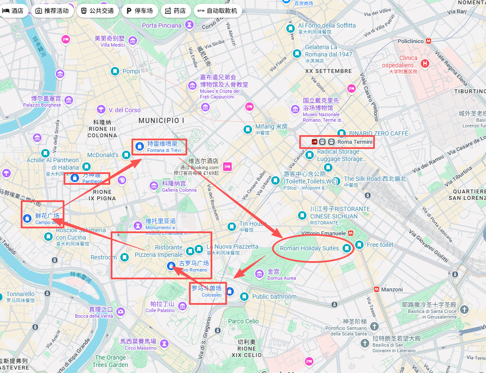
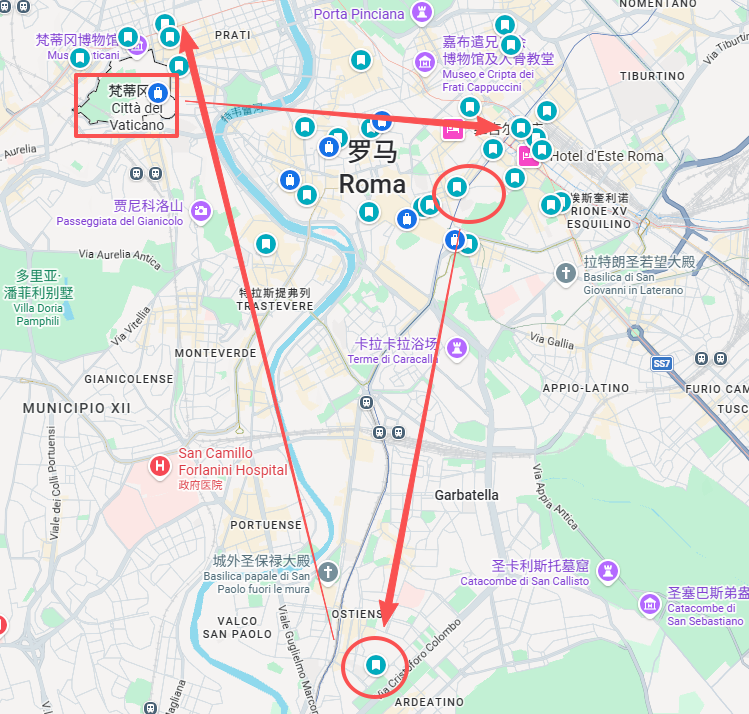
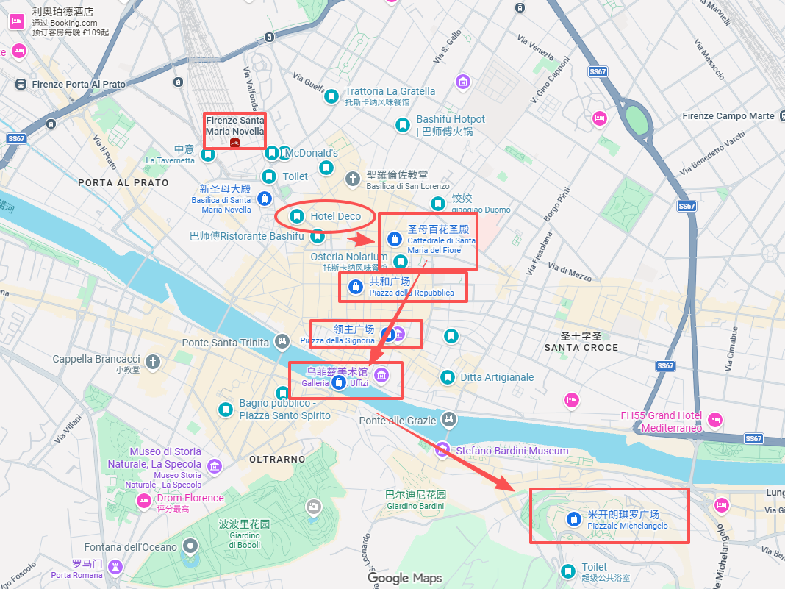
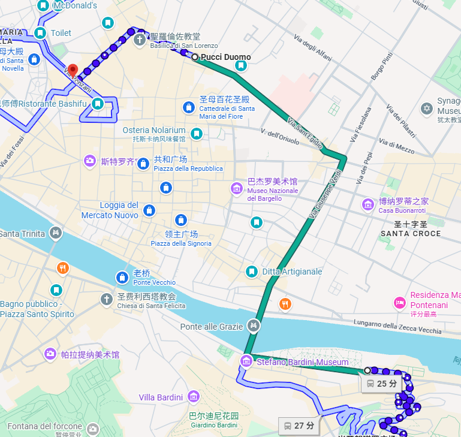
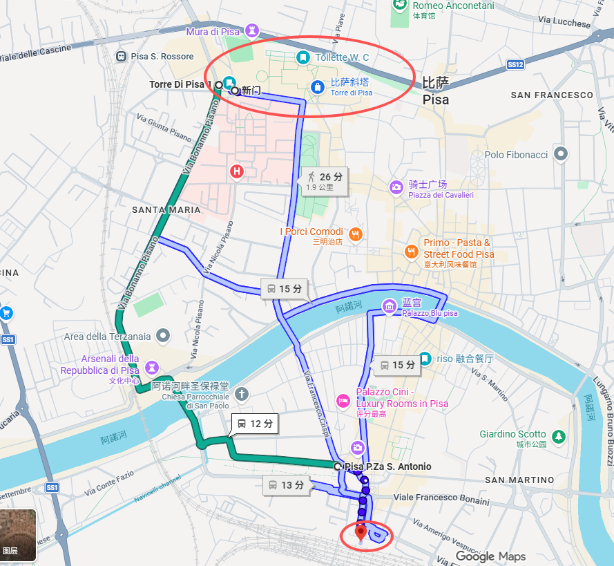
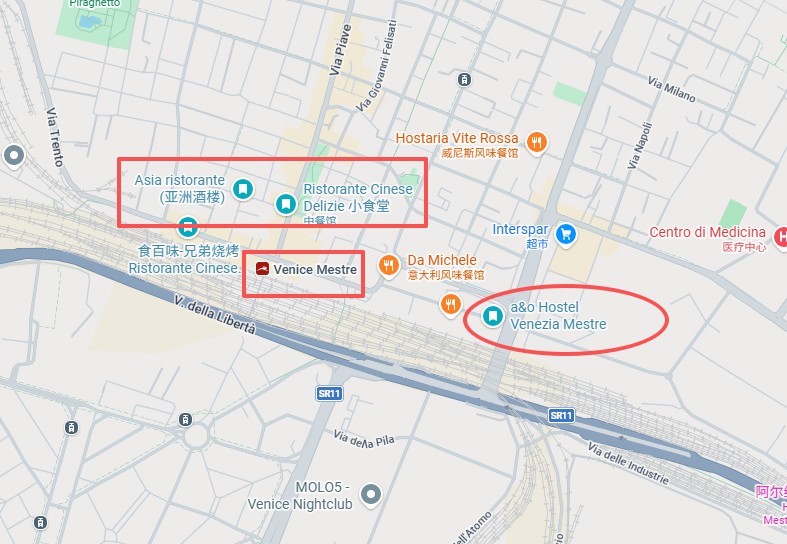
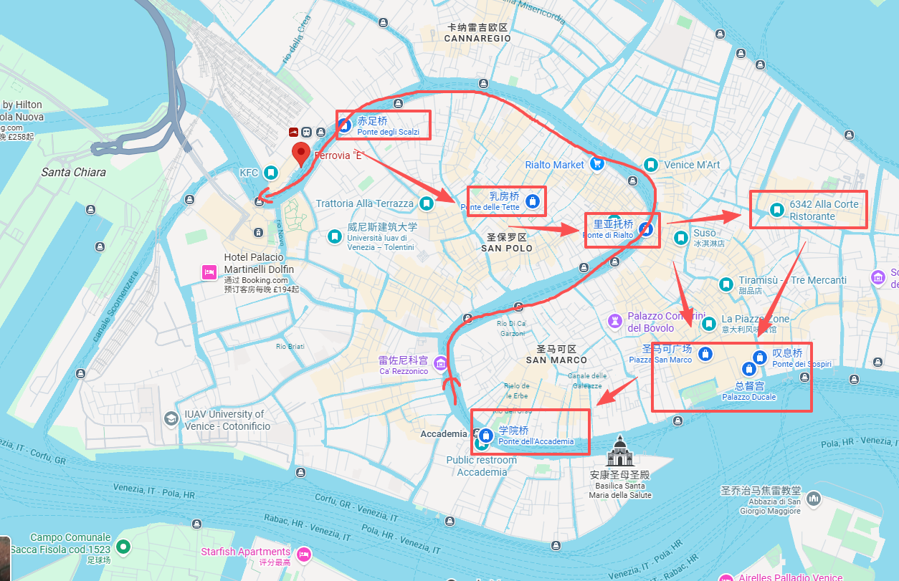
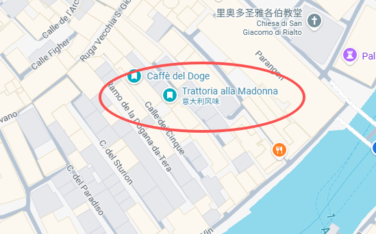
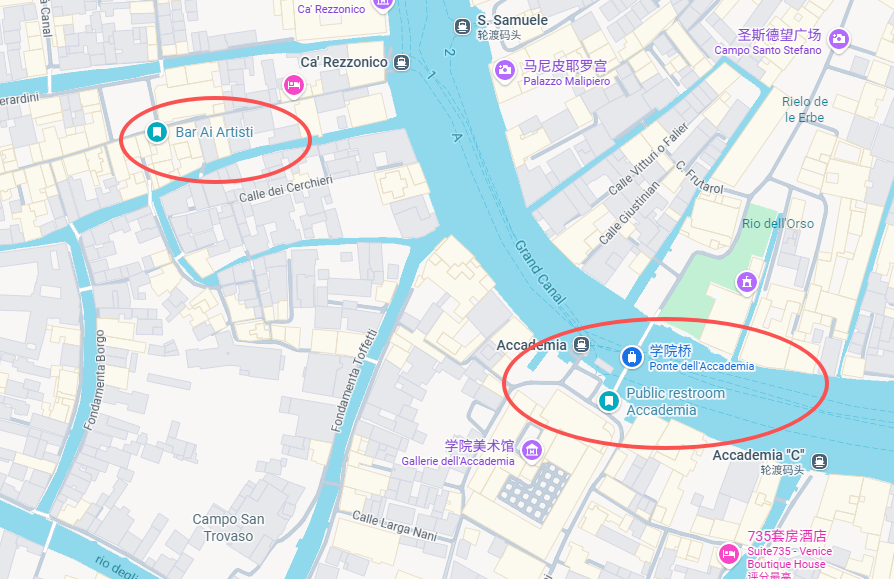
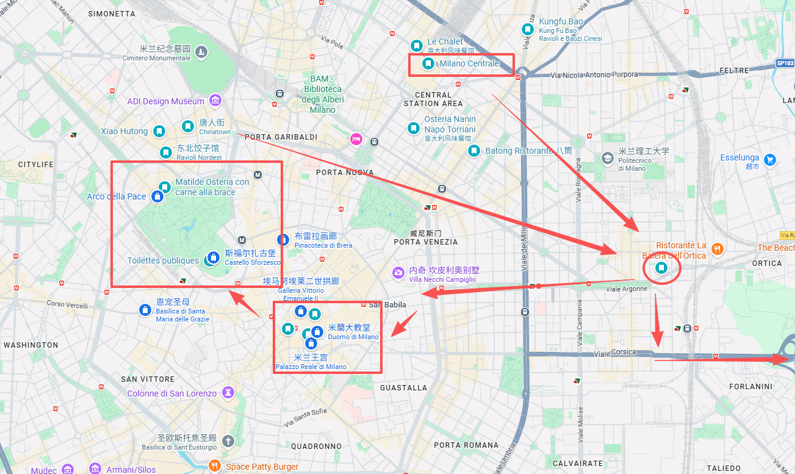

# 意大利行程总览（9/19–9/29）

> 旅行原则：不赶早、每天只抓少量重点、以 City Walk 为主；有大行李时优先打车/直达交通；不为“打卡”硬塞景点。

---

## 每日市内交通速查

| 日期 | 城市 | 当天怎么走 |
|---|---|---|
| **9/19** | 罗马 | 晚到 + 大箱子：**打车去酒店** |
| **9/20** | 罗马 | 酒店→斗兽场：地铁/公交；市区景点：**步行**；晚间换酒店：**打车** |
| **9/21** | 罗马 | 路演优先**打车**；结束后市区按位置步行/公交/地铁 |
| **9/22** | 罗马 | 酒店→梵蒂冈寄存：**打车**；梵蒂冈步行；取行李→Termini：**打车** |
| **9/22** | 佛罗伦萨 | SMN→酒店：近就步行，不想拖箱子就短程打车 |
| **9/23** | 佛罗伦萨 | 老城全程步行；米开朗基罗广场回程坐**23路公交** |
| **9/24** | 比萨 | 车站→斜塔：**公交**；广场步行；回车站看体力步行或公交 |
| **9/25** | 威尼斯 Mestre | 火车站→酒店：**步行约5分钟** |
| **9/26** | 威尼斯 | Mestre→主岛：区域火车；主岛步行；Accademia→Ferrovia：**Vaporetto 1号线** |
| **9/27** | 米兰 | Centrale吃饭后→酒店：优先地铁/公交，累或拖箱子不方便就打车 |
| **9/28** | 米兰 | **ATM纸质24小时票**；酒店→市中心公共交通；中心区步行；累了随时坐车 |
| **9/29** | 米兰 | 酒店→**M4蓝线**→Linate Airport |

---

## 已确认 / 计划预约

- **9/20 罗马斗兽场 Colosseum：11:15**
- **9/22 梵蒂冈博物馆 Vatican Museums：12:00**
- **9/24 比萨斜塔 Leaning Tower of Pisa：计划 15:30，尚未最终预约**
- **9/22 罗马 → 佛罗伦萨高铁：建议 17:00 以后**

---

## 一、罗马 Roma｜9/19–9/22

### 9/19｜抵达罗马
- **20:00** 左右抵达罗马。
- 前往 **Roman Holiday Suites** 入住。
- 当晚不安排景点，简单吃饭、休息。

### 9/20｜斗兽场 + 罗马市区 City Walk
**上午 / 中午**
- 酒店出发。
- **斗兽场 Colosseum：已预约 11:15**。
- 斗兽场结束后找附近吃午饭。
- 古罗马广场、威尼斯广场：顺路看即可，不强求完整参观。

**当天路线（按顺序）**
1. **罗马斗兽场｜Colosseo / Colosseum** — 已预约 11:15
2. **威尼斯广场｜Piazza Venezia** — 顺路看
3. **鲜花广场｜Campo de' Fiori** — 下午 City Walk
4. **纳沃纳广场｜Piazza Navona** — 顺路可加
5. **万神殿｜Pantheon** — 外观/广场为主
6. **特雷维喷泉｜Fontana di Trevi** — 傍晚拍照

**晚上**
- 市区吃晚饭。
- 回 Roman Holiday Suites 取行李。
- **带大箱子直接打车**去路演活动安排的酒店。

### 9/21｜路演日
- 上午：酒店休息、准备路演，不安排景点。
- **14:00 左右**：参加路演。
- **15:00–16:00 左右**结束后：
  - 如果有精神，随便去市区走走；
  - 不预设必须完成的景点。
- 可考虑西班牙广场、万神殿附近或特雷维喷泉附近，完全看当时位置和体力。

### 9/22｜梵蒂冈 + 前往佛罗伦萨
**上午**
- 酒店退房。
- 带行李前往梵蒂冈附近的寄存点，先寄存大箱子。
- **12:00** 预约进入梵蒂冈博物馆。
- 重点看：
  - 梵蒂冈博物馆
  - 西斯廷礼拜堂
- 预计 **2–2.5 小时**。
- 圣彼得大教堂不设为必去，有时间再看。

**下午**
- 取行李。
- 前往 **Roma Termini**。
- 建议预订 **17:00 以后**前往佛罗伦萨的高铁，避免梵蒂冈结束后赶车。
- 乘 Frecciarossa / Italo 前往 Firenze Santa Maria Novella。

### 罗马交通注意
- 市内短距离：步行。
- 普通公交/地铁：可直接 contactless 刷 Visa / Mastercard / Apple Pay。
- 带大行李：优先打车。
- 高铁电子票：按票面指定车次上车，不需要额外激活。
- Termini、斗兽场、梵蒂冈周边注意手机和钱包。

---

## 二、佛罗伦萨 Firenze｜9/22–9/25

### 9/22｜傍晚抵达
- 到 Firenze Santa Maria Novella。
- 酒店靠近火车站，放下行李。
- 附近中餐/晚饭。
- 当晚不安排正式景点。

### 9/23｜佛罗伦萨 City Walk
中午前后慢慢开始。

**推荐路线（按顺序）**
1. **圣母百花大教堂｜Cattedrale di Santa Maria del Fiore / Duomo di Firenze**
2. **共和国广场｜Piazza della Repubblica**
3. **野猪喷泉｜Fontana del Porcellino / Mercato del Porcellino**
4. **奥尔桑米凯莱教堂｜Chiesa di Orsanmichele** — 外观顺路看
5. **领主广场｜Piazza della Signoria**
6. **乌菲兹美术馆｜Galleria degli Uffizi** — 只看外观，不进馆
7. **老桥｜Ponte Vecchio**
8. **阿诺河｜Fiume Arno** — 沿河慢走
9. **米开朗基罗广场｜Piazzale Michelangelo** — 傍晚看全景

**米开朗基罗广场**
- 看城市全景和傍晚景色。
- 上坡较累，不建议强行走回酒店。
- 回程可直接坐 **23 路公交**回市区。

### 佛罗伦萨市内交通
- 老城主要靠走，不需要买日票。
- 23 路公交：
  - 市区单程票约 **€2 / 人**
  - 上车 contactless 刷卡
  - **市区公交下车不用刷**
  - 一人一张卡 / 一个支付设备

### 吃饭
- 第一天：酒店附近中餐。
- City Walk 当天：沿途随便选，建议中间至少找一次咖啡馆坐下来休息。
- 不需要为了“著名餐厅”专门绕路。

---

## 三、比萨 Pisa｜9/24 半日往返

### 上午
- 在佛罗伦萨睡醒、吃早午饭。
- **12:30 以后**从 Firenze SMN 出发。
- Regionale 区域火车前往 **Pisa Centrale**。
- 预计 **14:00 左右**到达。

### 当天路线（按顺序）
1. **比萨中央火车站｜Pisa Centrale**
2. **奇迹广场｜Piazza dei Miracoli / Piazza del Duomo**
3. **比萨斜塔｜Torre di Pisa** — 计划预约 15:30 登塔
4. **比萨大教堂｜Cattedrale di Pisa** — 外观为主
5. **圣若望洗礼堂｜Battistero di San Giovanni** — 外观为主
6. **比萨中央火车站｜Pisa Centrale** — 回程

### 到达后
- Pisa Centrale → 奇迹广场：
  - 建议去程坐公交，省体力。
  - 市区公交可直接 contactless 刷 Visa / 手机支付。
  - 单程约 **€2 / 人**
  - 上车刷一次，下车不用刷。

### 主要景点
1. 奇迹广场 Piazza dei Miracoli
2. 比萨斜塔 Torre di Pisa
3. 比萨大教堂外观
4. 洗礼堂外观

### 登塔
- **计划预约 15:30**（尚未最终确认）。
- 提前 20–30 分钟到。
- 整体预留约 **1 小时**：
  - 存包
  - 入场
  - 登塔
  - 顶部拍照
  - 下塔
- 穿舒服、防滑的鞋。

### 回程
- 16:30 后继续在广场拍照、休息。
- 17:00–17:30 左右回 Pisa Centrale。
- 有体力：步行约 25–30 分钟，顺便看阿诺河。
- 累了：直接坐公交回车站。
- 18:00 以后坐 Regionale 回佛罗伦萨。
- 晚饭回佛罗伦萨吃。

### 比萨交通注意
- Regionale 电子票按电子票规则使用。
- 如果买纸质区域票，留意是否需要上车前验证。
- 当天不用安排其他景点，斜塔是唯一需要卡时间的项目。

---

## 四、威尼斯 Venezia｜9/25–9/27

### 9/25｜佛罗伦萨 → 威尼斯 Mestre
- 睡醒、退房。
- 中午前后坐高铁前往威尼斯。
- 酒店住在 **Venezia Mestre 火车站旁边**，步行约 5 分钟。
- 放下行李。
- 酒店附近中餐选择很多，当晚可轻松吃饭、休息。

### 9/26｜威尼斯主岛一日
**约 11:30** 从 Mestre 酒店出发。

**交通**
- Mestre → Venezia Santa Lucia。
- 到主岛后开始步行。

**推荐路线（按顺序）**
1. **威尼斯圣露西亚火车站｜Venezia Santa Lucia**
2. **圣保罗区｜San Polo**
3. **道奇咖啡馆｜Caffè del Doge** — 第一休息点
4. **里亚托桥｜Ponte di Rialto**
5. **圣马可广场｜Piazza San Marco**
6. **圣马可大教堂｜Basilica di San Marco** — 外观为主
7. **总督宫｜Palazzo Ducale** — 外观为主
8. **叹息桥｜Ponte dei Sospiri**
9. **多尔索杜罗区｜Dorsoduro** — 慢慢散步
10. **艺术家酒吧｜Bar Ai Artisti** — 第二休息点
11. **学院桥｜Ponte dell'Accademia**
12. **学院桥码头｜Accademia** — 坐 Vaporetto 1号线
13. **火车站码头｜Ferrovia** — 下船后进 Santa Lucia

### 两个休息点
**Caffè del Doge**
- Rialto 附近。
- 适合作为第一段步行后的休息。

**Bar Ai Artisti**
- Dorsoduro / Accademia 附近。
- 适合下午后半段坐 30–45 分钟，再去学院桥。

### 威尼斯交通票
计划使用 **AVM Venezia Official App** 手机购票。

- 建议买 Venezia Daily Pass。
- **不要买完马上激活**。
- 第一次真正乘车/乘船时再激活。
- 激活后按要求出示/扫描动态二维码。
- 坐 Vaporetto 前按要求验证。
- 两个人各自要有自己的有效票。
- 手机务必满电，带充电宝。

### 威尼斯当天原则
- 不安排 Murano / Burano / Lido。
- 不硬塞室内景点。
- 核心就是：
  - Rialto
  - San Marco
  - 叹息桥
  - Accademia
  - 大运河 1 号线船程

---

## 五、米兰 Milano｜9/27–9/29

### 9/27｜威尼斯 → 米兰
- 中午前后从威尼斯出发。
- 抵达 **Milano Centrale**。
- 先在中央火车站附近吃晚饭。
- 再坐车去酒店。
- 当天不安排正式景点。

### 9/28｜米兰 City Walk
当天买 **ATM 纸质 24 小时票**。

**推荐路线（按顺序）**
1. **米兰大教堂｜Duomo di Milano**
2. **埃马努埃莱二世拱廊｜Galleria Vittorio Emanuele II**
3. **斯卡拉广场｜Piazza della Scala**
4. **布雷拉街区｜Brera** — 以街区散步为主
5. **斯福尔扎城堡｜Castello Sforzesco** — 外观和中庭
6. **森皮奥内公园｜Parco Sempione** — 休息
7. **和平门｜Arco della Pace**
8. **米兰唐人街｜Chinatown / Via Paolo Sarpi** — 晚饭

### 米兰景点策略
- 以拍照、街区散步为主。
- 不安排：
  - 布雷拉美术馆
  - 《最后的晚餐》
  - Duomo 登顶
  - 其他大型博物馆
- Brera 主要逛街区本身。

### ATM 纸质 24 小时票
- 第一次验证后开始计算 24 小时。
- 公交 / 电车：每次乘坐按规定验证。
- 地铁：进出闸机按要求刷票。
- 不需要依赖手机信号。
- 酒店离中心较远时，一日票很方便。

### 9/29｜前往 Linate Airport
- 早上退房。
- 前往 **Linate Airport**。
- 优先使用 **M4 蓝线**前往机场。
- 如果前一天 24 小时票仍在有效期内，可继续使用；否则单独购票即可。
- 预留足够时间前往机场。

---

# 全程住宿与换城市节奏

- **罗马：9/19–9/22**
- **佛罗伦萨：9/22–9/25**
- **威尼斯 Mestre：9/25–9/27**
- **米兰：9/27–9/29**

---

# 全程最重要的预约

1. **罗马斗兽场**：9/20
2. **梵蒂冈博物馆**：9/22，建议 10:30–11:30 左右
3. **比萨斜塔登塔**：9/24，建议 15:30 左右
4. 罗马→佛罗伦萨、佛罗伦萨→威尼斯、威尼斯→米兰的高铁：提前买更省心

---

# 全程交通记忆版

- **高铁**：电子票按指定车次直接上车。
- **Regionale 区域火车**：电子票按电子规则；纸票留意是否要验证。
- **罗马公交/地铁**：contactless 刷银行卡即可。
- **佛罗伦萨/比萨公交**：上车 contactless 刷卡；市区下车不用刷。
- **威尼斯**：手机 App 买 Venezia Daily Pass，首次使用时激活，乘船/乘车按要求验证。
- **米兰**：用 ATM 纸质 24 小时票，首次验证后计时，之后每次乘车继续按要求验证。
- **带大箱子时**：换酒店优先打车，不为了省一点交通费拖箱子折腾。
